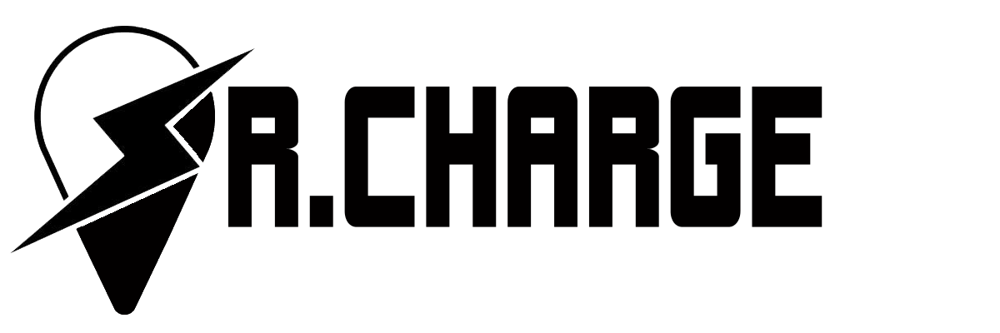

# Sr.Charge

Sr.Charge website was developed to help the Homeless Elderly find places (a.k.a Charging Stations) in Melbourne where they can charge their devices for free.

## Getting Started

## Built With

* [Laravel](https://laravel.com/) - The PHP web framework used
* [XAMPP](https://www.apachefriends.org/index.html) - The most popular PHP development environment and local cross-platform web server solution stack package 
* [phpMyAdmin](https://www.phpmyadmin.net/) - The administration tool for Sr.Charge database, which is using MySQL
* [Intellij](https://www.jetbrains.com/idea/) - The IDE used for writting source code
* [Github](https://github.com/) - The development platform used for storing source code and version control 

## Deployment 

Sr.Charge website is deployed on the [Hostinger](https://www.hostinger.com/), it provides a stable and fast web hosting enviornment. It also provide SSL certificate and several subdomains which is matched our IE requests. Here is the list of modifications in some files to make the webiste alive:
* [index.php](seniorcharge/public/index.php) in public_html on host file manager - Change the router for loader
* [.htaccess](seniorcharge/public/.htaccess) in public_html on host file manager - Enable the SSL/HTTPS
* [.env](seniorcharge/.env) in seniorcharge on host file manger - Change the database connection from local side to host server side
* [database.php](seniorcharge/config/database.php) in seniorcharge on host file manager - Add one 'option' field in 'mysql' connection

## Contributing
When contributing to this repository, please first discuss the change you wish to make via issue, email, or any other method with Team B3 - Homage, who is the onwer of this repository, before making changes.

### Pull Request Process

1. Ensure any install or build dependencies are removed before the end of the layer when doing a 
   build.
2. Update the README.md with details of changes to the interface, this includes new environment 
   variables, exposed ports, useful file locations and container parameters.
3. Increase the version numbers in any examples files and the README.md to the new version that this
   Pull Request would represent.
4. You may merge the Pull Request in once you have the sign-off of two other developers, or if you 
   do not have permission to do that, you may request the second reviewer to merge it for you.

## Versioning 

We use Github to do the version control, which is used to keep track of our work and helps us to easily explore the changes we have made, be it data, coding scripts, notes, etc. The GitHub workflow can be summarised by the “commit-pull-push” mantra, which is also used by our project versioning. Each file on GitHub has a history, so instead of having many files like SrCharge_1st_May.php, SrCharge_2st_May.php, you can have only one and by exploring its history, you can see what it looked at different points in time. For example, you can go to our [Homepage](seniorcharge/resources/views/home.blade.php) file, and click the ['histroy'](https://github.com/yyu130/SeniorCharge/commits/master/seniorcharge/resources/views/home.blade.php) button to view the completed workflow that we did for homepage file.  

Meanwhile, we have created subdomains for different versions of Sr.Charge website, Here are the website links:
- Iteration 1 - [https://iteration1.seniorcharge.me](https://iteration1.seniorcharge.me)
- Iteration 2 - [https://iteration2.seniorcharge.me](https://iteration2.seniorcharge.me)
- Final Product - [https://seniorcharge.me](https://seniorcharge.me)

## Authors

Sr.Charge is developed by Team B3 - Homage. Here are all contributors who participated in this project:

* **Abhinav Choudhary** - *Product Owner / UI/UX Designer / Analyst* 
* **Jinyun Liu** - *UI/UX Designer / Analyst / Lead Graphics/Content* 
* **Rina Reinoso** - *Project Manager / Data Governance* 
* **Yinlong Yu** - *Lead Software Developer* 

## Code of Conduct

Since we use the Laravel web framework for Sr.Charge website, we need to review and abide by the [Code of Conduct](https://laravel.com/docs/contributions#code-of-conduct) to make sure no violations happened: 
- Participants will be tolerant of opposing views.
- Participants must ensure that their language and actions are free of personal attacks and disparaging personal remarks.
- When interpreting the words and actions of others, participants should always assume good intentions.
- Behavior that can be reasonably considered harassment will not be tolerated.

## License

The website is built with Laravel - PHP web framework. The Laravel framework is open-sourced software licensed under the [MIT license](https://opensource.org/licenses/MIT).
