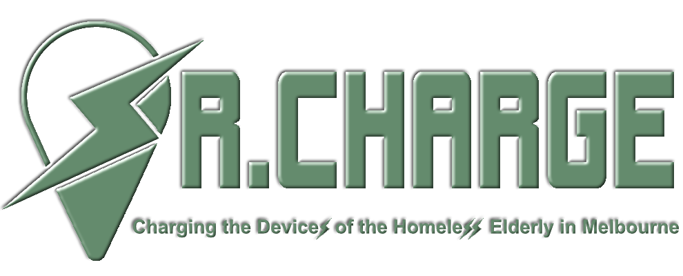

# About Sr.Charge

Sr.Charge website was developed to help the Homeless Elderly find places (a.k.a Charging Stations) in Melbourne where they can charge their devices for free.

## Getting Started

These instructions will get you a copy of the project up and running on your local machine for development and testing purposes. See deployment for notes on how to deploy the project on a live system.

## Built With

* [Laravel](https://laravel.com/) - The PHP web framework used
* [XAMPP](https://www.apachefriends.org/index.html) - The most popular PHP development environment and local cross-platform web server solution stack package 
* [phpMyAdmin](https://www.phpmyadmin.net/) - The administration tool for Sr.Charge database, which is using MySQL
* [Intellij](https://www.jetbrains.com/idea/) - The IDE used for writting source code
* [Github](https://github.com/) - The development platform used for storing source code and version control 

## Deployment 

## Versioning 

We use Github to do the version control, which is keepping track of our work and helps us to easily explore the changes we have made, be it data, coding scripts, notes, etc. 

Here are three differnet versions for Sr.Charge website:
- [Iteration 1](https://iteration1.seniorcharge.me)
- [Iteration 2](https://iteration2.seniorcharge.me)
- [Final Product](https://seniorcharge.me)

## Authors

Sr.Charge is developed by Team B3 - Homage. Here are all contributors who participated in this project:

* **Abhinav Choudhary** - *Product Owner / UI/UX Designer / Analyst* 
* **Jinyun Liu** - *UI/UX Designer / Analyst / Lead Graphics/Content* 
* **Rina Reinoso** - *Project Manager / Data Governance* 
* **Yinlong Yu** - *Lead Software Developer* 

## License

The website is built with Laravel - PHP web framework. The Laravel framework is open-sourced software licensed under the [MIT license](https://opensource.org/licenses/MIT).

